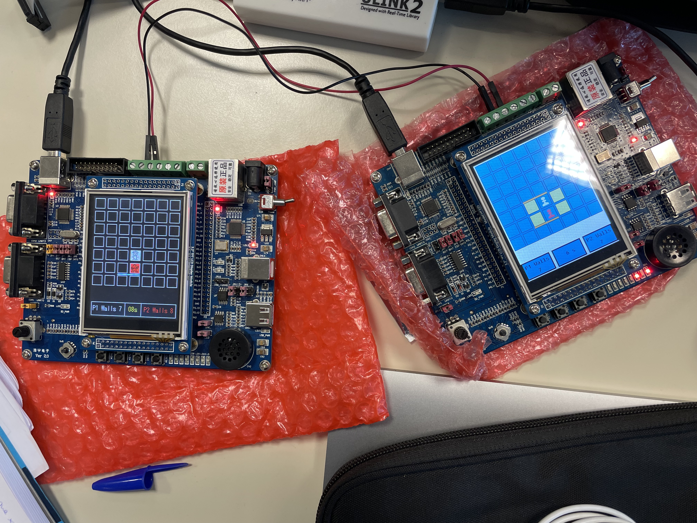

# quoridor

Implementation (without the BSP) of the Quoridor game on the LandTiger LPC1768 ARM board.

## Features
- The game support multi-board gameplay through the CAN-bus
- In the `magda` folder there's a bot implemented with a Minimax algorithm
